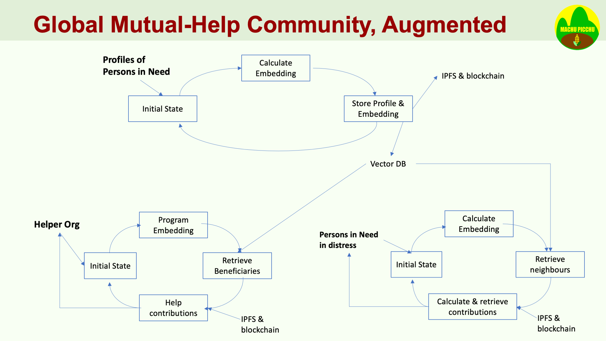

*Work in Progress on January 29* …
# Machu Picchu stories in ETH Global 2025
## Context of the Document
This document reminds what is **Machu Picchu** and describes potential **ETH Global 2025 projects** that can be carried out on the theme of Machu Picchu.

The Inca citadel Machu Picchu was built using **huge stones, themselves well crafted, that are assembled together to make even bigger monuments**.

Machu Picchu is an open-source project that leverages 21st century tools for humanitarian purposes: https://kvutien-yes.medium.com/project-machu-picchu-white-paper-2024-part-1-735b60c55a92. 

With the severe cuts that the new US Trump administration has imposed on humanitarian budgets, these organizations could take the opportunity **to think outside their routine practices** and consider the facilities brought by the Internet, low-cost low-power Raspberry-Pi's and similar, free Earth Observation resources and tools, blockchain technologies and Artiificial Intelligence.

# Executive Summary
This document is a list of scenarios that can support hackathon projects in **ETHGlobal 2025**. The scenarios belong to the context of Machu Picchu.

The Machu Picchu stories can inspire several competing ETHGlobal projects, where each project will focus on a particular aspect of Machu Picchu as best suits the skills of the team. Machu Picchu is like the Inca citadel of same name, that is made of huge stone blocks tightly fit together. These blocks of stone can be done independently. In past prototypes, Machu Picchu applied tools in DeFi, IPFS, AI, Earth Observation, low-cost Raspberry Pi-style SBCs with AI HATs.

The AI Agents are potentially Machu Picchu blocks. In this hackathon each project may choose to address a subset of Machu Picchu functions that best suits the skills of the team yet to be built. Even if you prefer doing a hackathon project alone around Machu Picchu, you are heartily welcome.

The following resources explain the story told by Machu Picchu and the technologies that have been already prototyped:
1. A 10' video of **overall Machu Picchu**: https://youtu.be/z1ylfi60ES0
2. A **White Paper**: https://github.com/kvutien/Project-Machu_Picchu_White_Paper_2024
3. An example of how **AI** can help the persons in need: https://medium.com/@kvutien-yes/hands-on-how-ai-can-help-persons-in-need-0fc5ca8e49a8
4. A Raspberry Pi serving as **IPFS storage**: https://kvutien-yes.medium.com/machu-picchu-persistent-ipfs-node-on-raspberry-pi3-part-1-fb6fd67e421a
5. A simple illustration of **Earth Observation** to monitor crops: https://kvutien-yes.medium.com/ninja-code-make-a-satellite-mosaic-image-with-the-least-clouds-possible-8a25759f875b

#	Principles of the Mutual-Help Community
The risk sharing scenario is as follows:
- Ms. *Lakshmi Devi* lives in Tamil Nadu, near Melur. She is married with 5 kids. She cultivates a small piece of land and has some poultry.
- She publishes her profile in free form, with the help of DHAN Foundation (.https://dhan.org/). Her profile is embedded as a vector; the full text and the vector are stored on IPFS and the CID (the IPFS hash) is stored on the blockchain. Think of it like your LinkedIn profile. 🙂
- Every month, she can spare 2 €. She keeps in the blockchain (L2 Polygon for example) 1€ as private savings and she puts the other 1€ in a common risk-sharing pool. She accesses the blockchain from her simple mobile Nokia old phone with the support of a DHAN field helper, using a mobile tablet and Account Abstraction.

She can retrieve her money, from her savings and from the risk-sharing pool, as follows:
- She can retrieve money from her savings any time, without penalties.
- She can retrieve money from her account in the risk-sharing pool also any time, albeit with 20% penalty.
	
However, if she declares a distress and calls for help, her situation is assessed by a community of peers and neighbors by a blockchain vote and she can be allowed to retrieve her money without penalties. The procedure is the following:
- Reality of a need is determined by a peer-to-peer community **blockchain vote**, or any other means in the Machu Picchu initial bootstrap period.
- **If the distress is confirme**d, she is allowed to retrieve any amount from her share in the common pool **without penalties**. 
- She is also entitled to an **additional community help** in case of distress. The amount of this community help is equal to *5x* (to be confirmed) the share that Ms *Lakshmi Devi* has accumulated in the community risk-sharing pool. This bonus rewards how faithfully she has contributed to the common help pool, that benefits everybody.
- This additional help is taken from the risk-sharing pool of other participants in the community. Each contribution is determined by the scalar distance of their embedding vectors to the vector of Ms. *Lakshmi Devi*. The agreement is as follows: each of the 50 nearest contributes 1% of the amount, each of the 100 next nearest contributes 0.5% of the amount. The amount may be less if the shares of all the participants are too low.
- There are measures to encourage long term participation and avoid cheats when people only start to contribute in the few months preceding the declaration of their distress. This can be simulated and evaluated during a hackathon project.
	
#	List of possible projects
In general, we could implement projects along the following workflow:
- start with a freeform list of profiles of small farmers worldwide. An initial version has been started: https://github.com/kvutien/Doc-Simulated_profiles_Persons_in_Need
- use an embedding tool like Weaviate or VoyageAI to generate embeddings.
- store the profiles and the embeddings of each farmer on IPFS.
- store the CID of each record on the blockchain.
- demo: decide that a farmer needs financial help.
- from a vector database, Weaviate or equivalent, determine n closest profiles that can help, calculate the contributions and execute.

See an AI example here: https://kvutien-yes.medium.com/hands-on-how-ai-can-help-persons-in-need-0fc5ca8e49a8

Some possible projects in the hackathon could be:
1. **Project "Wonderful Life"**: An agent that uses AI to simulate free text profiles of persons in need, living in various countries in the world. It uses an SLM to create embeddings and stores the profiles + embeddings on IPFS and their CID hashes on blockchain. Given a Program sheet of an international Helper Program, it finds all potential beneficiaries of such Helper Program.
2. **Project "Three Musketeers"**: TO BE DEFINED
3. **Project "Good Samaritan"**: An agent that would be given a person in need suffering a crop loss requesting an amount of ERC20 tokens, retrieve its CID on the blockchain, read on IPFS the profile + embedding of this person, find 100 closest profiles, transfer from each wallet of these persons 1/100 of the ERC20 amount needed to help the person in need
4. **Project "Robin Hood"**: An agent that simulates at any moment the potential maximum entitlement of a person contributing to the risk-sharing pool. The results are used to define the risk-sharing agreement. In operation this evaluation of potential help can be used to motivate the persons to join.
5. **Project "Knights of the Round Table"**: An agent that would use the quick Google Earth Engine webapp from the code of illustration 5 above and decide on the reality of a crop loss and a financial distress to trigger help.
	
#	Projects Detailed
##	Project "*Wonderful Life*": Simulated Mutual-Help Community
This project has its name from the 1946 movie of Frank Capra https://en.wikipedia.org/wiki/It%27s_a_Wonderful_Life. 

It focuses on building the overall cement that link the blocks together. This means building the transition tree, setting up live interfaces between the Agents and their plugins, the Clients (distress listener, blockchain), the database Adaptors (vector database, IPFS). The internals of all functions are simulated enough to action the state transitions and the actions.

The focus of this project is on the database adapters, IPFS and vector database, as well as on storing the IPFS hash (the CID) on the blockchain). In the limits of the hackathon, we implement only the Helper Org part.
- We read a profile from a text file
  - Bonus: Eventually we do some magic AI on the profile to find which blockchain account it is associated to. This will be needed when Machu Picchu will use Account Abstraction, but this phase can be simulated in the current hackathon.
  - Bonus: If time allows, we create the account if it doesn't exist. This means that we do the Account Abstraction onboarding step. But this phase can be simulated in the current hackathon.
  - Bonus: potentially in the future we can even use AI Speech-To-Text to write the text of the profile. It is anyhow in free form.
- We do embeddings of the profile. In the future we do some magic AI on the profile (I don't know yet what magic 😉) before doing the embeddings.
- We store the whole on IPFS and receive back the CID (the IPFS hash) of this person's profile
- We store the CID on the blockchain account of the person. 

In the Helper Org part:
- We read a Help Program Sheet and embed it.
- We find all profiles of Persons in Need that are closest to the objectives described in the Program Sheet.

**Cheery on the cake**: we implement a Tweeter agent that discusses with the potential donors. In the future, we will implement a gamification of several parts of the whole process. Humanitarian Aid is done too seriously today because it is centralized in "**serious**" organizations.

##	Project "*Three Musketeers*": Profiles Creation, Embedding and Storage
This project has its name from the French novel of the same name https://youtu.be/if4AL4fXrT8. Their famous motto is "*All for one, and one for all*"

To be defined… This could be a gamification of the previous project.

##	Project "*Good Samaritan*": Profile Matching, Contribution Retrieval
This project has its name from the Gospel parable of the Good Samaritan, where a victim of robbers is ignored by important people and helped by a good man https://en.wikipedia.org/wiki/It%27s_a_Wonderful_Life. 

The focus of this project is on the heart of the decentralized risk-sharing. 

It does matching of the profile embedding of a person in need and its neighbors, in the sense that they all share similar activities and risks. From the resulting matching, based on the agreement that the closer the helper is to the person in need, the higher will be the help amount. The agent will calculate the amount to transfer from each "neighbor" and launch the blockchain transactions.

This project applies the following story:
- There are *poolSize* participants to the risk sharing pool. Say *poolSize* = 10. We choose 10 because it is the usual number of virtual accounts generated by an Ethereum development environment, Hardhat, Truffle or Ganache. In reality, the number would be much bigger.
- One person is in need. Let's assume it is virtual account 1. The 9 others are potential helpers.
- We assume that the amount required to help the person in need is *helpNeeded* = 0.01 ETH.
- Each virtual account will have the same amount of ETH initially. It's the one generated by the development environment simulator (10 ETH).
- We (the agent) retrieve from IPFS the profile embedding vector of the person in need and the 9 others. Alternatively, we already have in a vector database all profiles.
- We do a normalized scalar search to find the closest profiles in ascending order of the cosine.
- We do a table lookup for the percentage of the total help each neighbor has agreed to contribute. For example, the 2 closest contribute for 10% each, the 4 next contribute for 5% each, total is 40%. The scenario stops there. Note that these figures will be different in real life. More probably, the first 20 closest will contribute for 1% each, the next 40 will contribute for 0.5%, the next 80 will contribute for 0.25%, the next 160 will contribute for 0.125%, the next 320 will contribute for 0.0625%.
- For each virtual account, we do a transfer to the account of the person in need.

Bonus: in the constructor of the agent, we generate and use a fungible token named **HELP**. In Machu Picchu, the HELP tokens would be minted at the beginning of the project.
##	Project "*Robin Hood*": Assistance Entitlement dashboard
This project has its name from the legendary outlaw who stole from the rich to give to the poor, symbolizing the idea of helping those in need, https://en.wikipedia.org/wiki/Robin_Hood. 

The purpose of the agent is to help us determine generally the terms and conditions of the mutual help agreement that will be written on stone in the blockchain. It aims to motivate people to participate and also to avoid misbehaviors. The rough idea is as follows:
- Ms. *Lakshmi Devi* has one wallet for personal savings and one wallet for mutual help. We are mainly concerned with the latter.
- She can do freely inflows and outflows with her personal savings wallet.
- Her personal mutual help wallet has mostly inflows. Any outflow bears a 20% retrieval fee. This retrieval fee will go to a community mutual help wallet.
- The retrieval fee will not apply, or apply partially, if the retrieval need of Ms. *Lakshmi Devi* is approved by the community.
- In addition, in case of approval, Ms. *Lakshmi Devi* will also receive help taken from the mutual help wallets of her "close neighbors". The degree of proximity of each neighbor is measured by the scalar distance of their profile embeddings from the profile embedding of Ms. *Lakshmi Devi*.
- The total amount of mutual help is measured by the "merit" of Ms. *Lakshmi Devi* in the mutual help: regularity in contributing to her mutual help wallet, absolute importance of her mutual help wallet, amounts contributed in recent months, etc. 
- When defining the rules, we want to reward Ms. *Lakshmi Devi* based on her seniority in the mutual help. The seniority of the contributions is also important: massive recent contributions will count less than the same amount spread over longer time..

The agent in this project will use AI to imagine varied contribution behaviors, to evaluate their degree of compliance to solidarity practices, and propose rules to reward well-behaved behaviors and penalize the bad practices.This helps to refine the rules,

The same agent will be used in operations as a dashboard to show people how, in case of crisis, their behaviors will result in community help, to motivate good behaviors.
##	Project "*Knights of the Round Table*": Loss Simulation & Distress Voting
This project can be gamified, by its nature.

This project has its name from the legendary King Arthur and his Knights of the Round Table, symbolizing a diverse group who come together to serve a common purpose, upholding justice and protecting the kingdom https://youtu.be/4Gt99POfaSk. 

The purpose of the agent is to gather a number of persons closest persons to the demander (for example Ms. *Lakshmi Devi*) and ask them to vote whether they agree or not with the actual need. Closeness is measured by the scalar distance of the embeddings.

# Lessons learned from the ETH Global hackathon *Agentic Ethereum*
All the project descriptions are listed here (select event = *Agentic Ethereum*): https://ethglobal.com/showcase

## My analysis of the 10 Finalists:
### Application domains
- **Digital Assets Management**: tokens, [*Bouncer AI*](https://ethglobal.com/showcase/bouncer-ai-1sd06)  offers a platform for creating token launchpads with AI-driven access controls, [*Streme.fun*](https://ethglobal.com/showcase/streme-fun-4dppy) enables the easy deployment of tokens, 
- **AI-Enhanced Social Media**: [*SmolUniverse*](https://ethglobal.com/showcase/smol-universe-nqh0z) simulates a fictional universe where AI clones interact with tweets and memes, [*PvPvAI*](https://ethglobal.com/showcase/pvpvai-d66a8) involves AI agents discussing and sreading false news on token markets
- **DeFi Tooling and Optimisation**: [*Nimble*](https://ethglobal.com/showcase/nimble-d5y6f) orchestrates AI solver agents to find optimal swap routes, [*Streme.fun*](https://ethglobal.com/showcase/streme-fun-4dppy) integrates Superfluid for streaming tokens and Uniswap for liquidity provision
### Style of projects
- **AI-Driven Personalised Experiences**: [*Bouncer AI*](https://ethglobal.com/showcase/bouncer-ai-1sd06) assesses users based on their knowledge, vibe, and wallet activity, [*PvPvAI*](https://ethglobal.com/showcase/pvpvai-d66a8) uses AI agents with unique personality trait, [*SecretAgent.sh*](https://ethglobal.com/showcase/secretagent-nkz1u) analyses agent behaviour to provide custom security recommendation
- **Gamified Learning**: [*PvPvAI*](https://ethglobal.com/showcase/pvpvai-d66a8) gamifies the prediction of token market movements, 
- **(DAO) Tooling**: [*Bouncer AI*](https://ethglobal.com/showcase/bouncer-ai-1sd06) help DAOs to decide who gets access to governance tokens, [*PvPvAI*](https://ethglobal.com/showcase/pvpvai-d66a8) help with automated decision-making and prediction within a DAO, [*SecretAgent.sh*](https://ethglobal.com/showcase/secretagent-nkz1u)  provides the secure secret management infrastructure required for a DAO
### Technology
- Security and Access Control
- Tokenomics

#	Work in progress…
Stay tuned.

Questions are welcome
